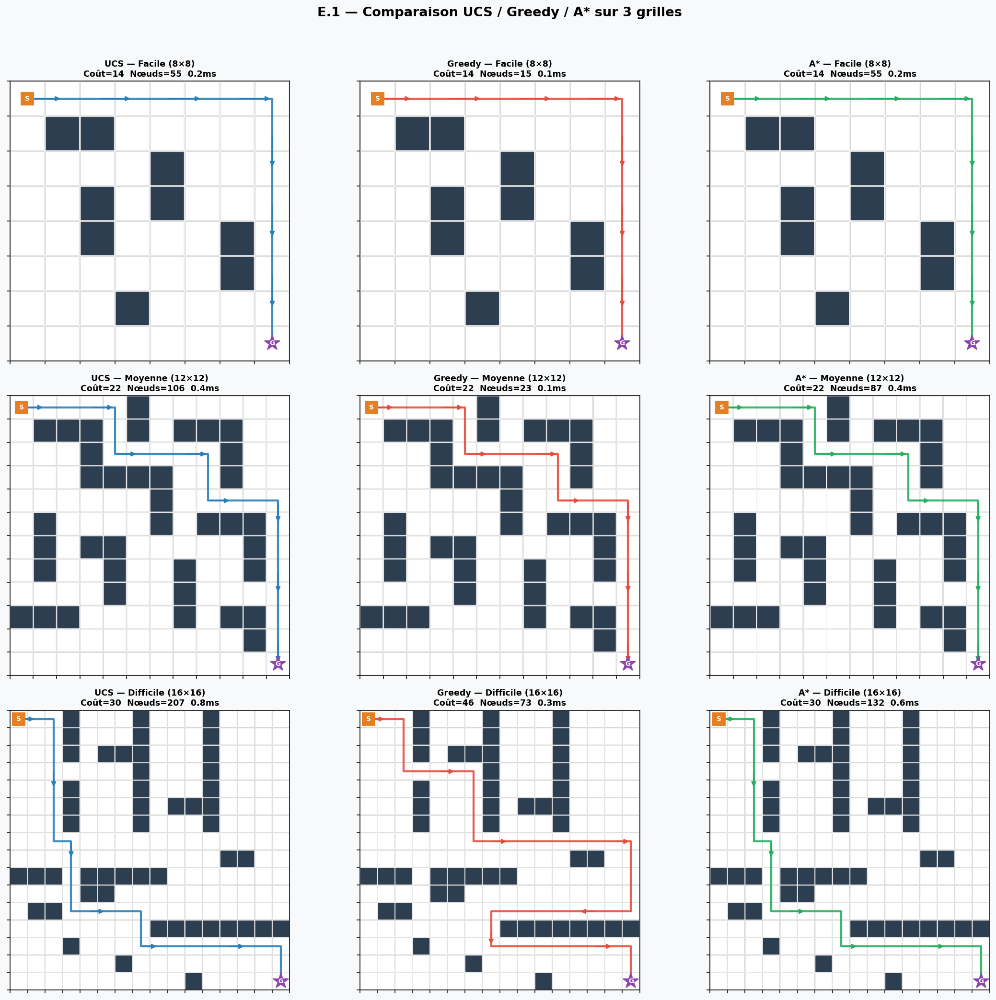
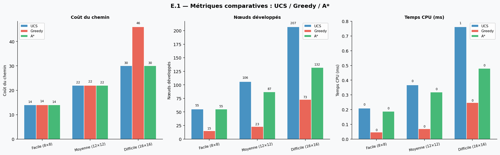
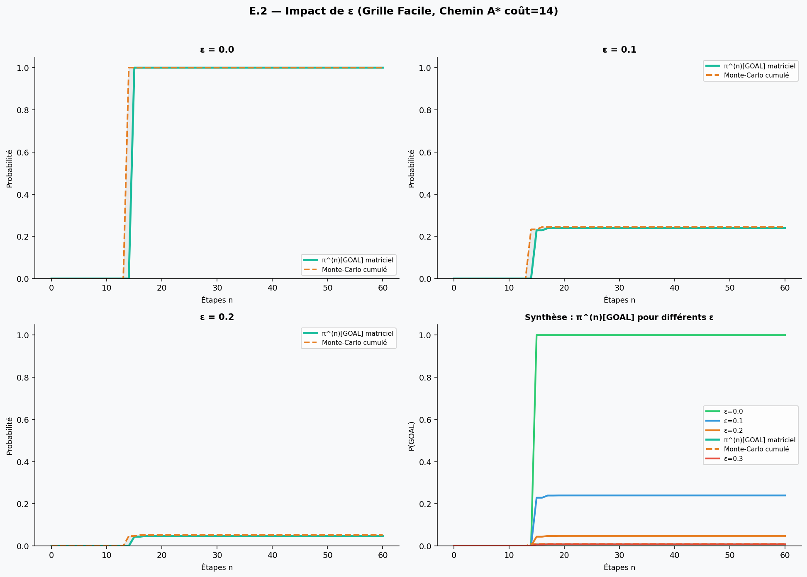
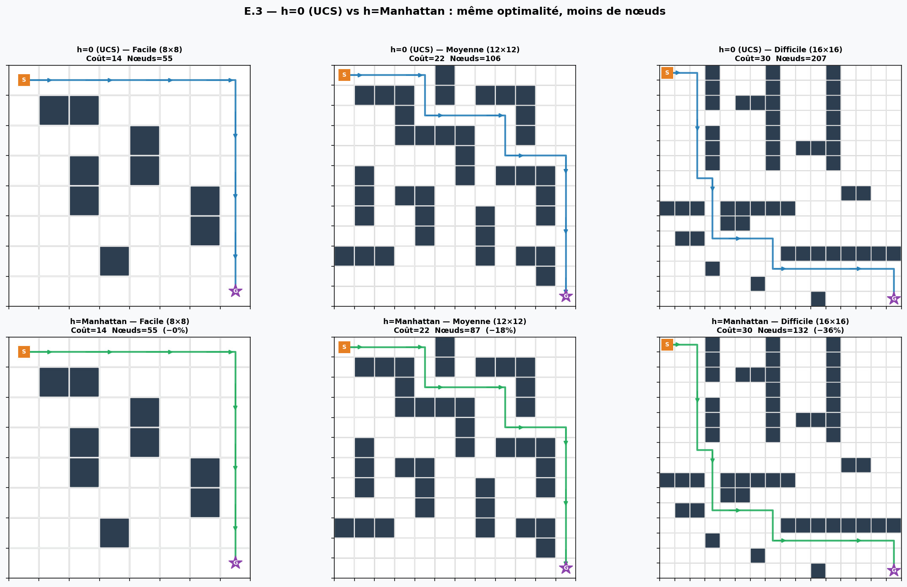
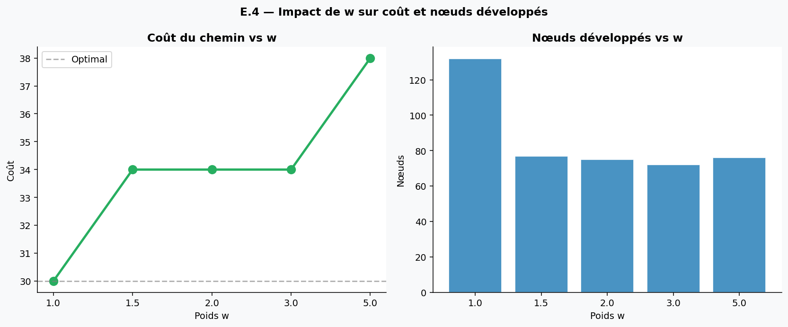
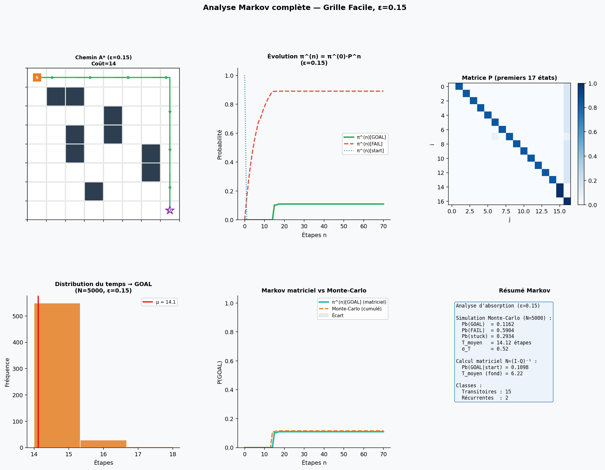
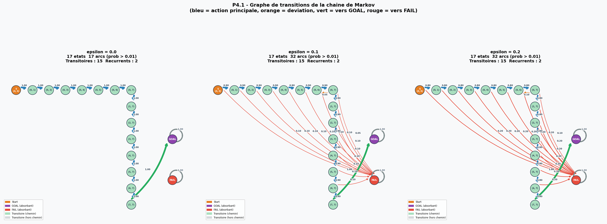
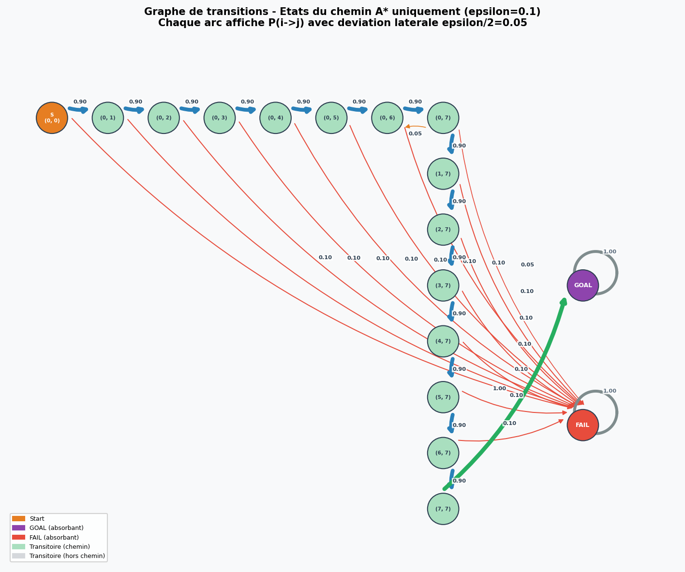

<div align="center">

# Planification Robuste sur Grille
## A\* · Chaînes de Markov · Monte-Carlo

[](https://www.python.org/)
[](https://numpy.org/)
[](https://matplotlib.org/)
[](https://jupyter.org/)
[](LICENSE)
[]()

**Mini-projet Intelligence Artificielle — Mars 2026**

*Recherche heuristique optimale (A\*) + modélisation stochastique (Chaînes de Markov) pour évaluer la robustesse d'un plan déterministe face à l'incertitude d'exécution.*

[Vue d'ensemble](#-vue-densemble) • [Installation](#-installation) • [Utilisation](#-utilisation-rapide) • [Résultats](#-résultats) • [Maths](#-fondements-mathématiques) • [API](#-référence-api)

</div>

---

## Vue d'ensemble

Un agent autonome navigue de `(0,0)` vers `(N-1, N-1)` dans une grille 2D avec obstacles. Le projet répond à deux questions complémentaires :

1. **Comment trouver le chemin de coût minimal ?** → Algorithmes de recherche heuristique : UCS, Greedy, A\*, Weighted A\*
2. **Ce plan reste-t-il bon quand les actions sont incertaines ?** → Chaîne de Markov paramétrée par ε (probabilité de déviation latérale)

### La question centrale

> Avec seulement **10% d'incertitude** (`ε = 0.1`), un plan A\* *optimal* a une probabilité réelle de succès de **24.5%** seulement — 3 trajectoires sur 4 échouent.

Ce projet quantifie rigoureusement cet écart via calcul matriciel exact `N = (I−Q)⁻¹` et simulation Monte-Carlo sur 5 000 trajectoires.

---

##  Structure du projet

```
projet-astar-markov/
│
├──  astar.py                    # Algorithmes de recherche heuristique
│                                  #   manhattan, neighbors, astar, ucs, greedy,
│                                  #   weighted_astar, extract_policy
│
├──  markov.py                   # Chaînes de Markov complètes 
│                                  #   build_transition_matrix, compute_pi_n,
│                                  #   find_communication_classes, absorption_analysis,
│                                  #   simulate, compare_matrix_vs_simulation
│
├──  experiments.py              # Toutes les expériences E.1→E.4 + graphes 
│
├──  experiments.ipynb  # Notebook interactif 
│
├──  figures/                    # 9 figures générées automatiquement
│   ├── E1_grilles.png             # Chemins UCS / Greedy / A* sur 3 grilles
│   ├── E1_barchart.png            # Bar chart comparatif
│   ├── E2_epsilon.png             # π^(n)[GOAL] matriciel vs Monte-Carlo pour ε ∈ {0…0.3}
│   ├── E3_heuristics.png          # h=0 vs h=Manhattan sur 3 grilles
│   ├── E4_weighted.png            # Weighted A* : carte chemin pour w ∈ {1…5}
│   ├── E4_weighted_curves.png     # Coût et nœuds en fonction de w
│   ├── Markov_full.png            # Analyse Markov complète (6 panneaux)
│   ├── Transition_graph.png       # Graphe de transitions pour ε ∈ {0, 0.1, 0.2}
│   └── Transition_graph_zoom.png  # Vue zoomée états du chemin (ε = 0.1)
│
└──  README.md
```

---
##  Installation

### Prérequis

```
Python 3.10+
NumPy  ≥ 1.24
Matplotlib ≥ 3.7
```

Le projet n'utilise **aucune dépendance externe lourde** — uniquement la bibliothèque standard Python (`heapq`, `collections`, `time`) et NumPy / Matplotlib.

### Cloner et installer

```bash
git clone https://github.com/Abdessamad-PRO/Mini-Projet-Astar-Markov.git
cd Mini-Projet-Astar-Markov

# Avec pip
pip install numpy matplotlib

# Ou avec conda
conda install numpy matplotlib
```

---

##  Utilisation rapide

### Lancer toutes les expériences

```bash
python experiments.py
```

Génère **9 figures** dans `figures/` et affiche les tableaux de résultats en console.

### Exemple minimal — planification + analyse stochastique

```python
import numpy as np
from astar import astar_manhattan, extract_policy
from markov import build_transition_matrix, compute_pi_n, simulate, absorption_analysis

# 1. Définir une grille (0 = libre, 1 = obstacle)
grid = np.array([
    [0, 0, 0, 0, 0],
    [0, 1, 1, 0, 0],
    [0, 0, 0, 0, 1],
    [0, 0, 1, 0, 0],
    [0, 0, 0, 0, 0],
])
start, goal = (0, 0), (4, 4)

# 2. Planifier avec A* Manhattan
path, cost, expanded, open_max, elapsed, stats = astar_manhattan(grid, start, goal)
print(f"Chemin optimal : coût={cost}, {expanded} nœuds développés, {elapsed*1000:.2f} ms")
# → Chemin optimal : coût=8, 14 nœuds développés, 0.12 ms

# 3. Extraire la politique (dict état → action)
policy = extract_policy(path)

# 4. Construire la Chaîne de Markov avec ε = 0.1
P, states, sidx = build_transition_matrix(grid, policy, epsilon=0.1)
print(f"Matrice P : {len(states)} états, stochastique : {abs(P.sum(axis=1) - 1).max():.2e}")

# 5. Évolution de la distribution : π^(n) = π^(0) · P^n
pi0 = np.zeros(len(states))
pi0[sidx[start]] = 1.0
history = compute_pi_n(pi0, P, n_steps=50)
print(f"P(GOAL à n=50) = {history[50, sidx['GOAL']]:.4f}")

# 6. Simulation Monte-Carlo (N=2000 trajectoires)
sim = simulate(policy, grid, start, epsilon=0.1, N=2000, seed=42)
print(f"Pb(GOAL) = {sim['prob_goal']:.4f} | Pb(FAIL) = {sim['prob_fail']:.4f}")
print(f"T_moyen si succès = {sim['mean_time']:.1f} étapes")

# 7. Analyse d'absorption analytique N = (I-Q)^{-1}
absorp = absorption_analysis(P, states, sidx)
if absorp:
    tr = absorp['transient_states']
    ab = absorp['absorbing_states']
    if start in tr and 'GOAL' in ab:
        i = tr.index(start)
        k = ab.index('GOAL')
        print(f"Pb(GOAL) matriciel  = {absorp['B'][i,k]:.4f}")
        print(f"T_moyen matriciel   = {absorp['t_mean'][i]:.2f} étapes")
```

### Comparer tous les algorithmes sur une grille personnalisée

```python
from astar import ucs, greedy, astar_manhattan, weighted_astar

algos = {
    "UCS":            lambda g, s, e: ucs(g, s, e),
    "Greedy":         lambda g, s, e: greedy(g, s, e),
    "A* Manhattan":   lambda g, s, e: astar_manhattan(g, s, e),
    "Weighted A*(2)": lambda g, s, e: weighted_astar(g, s, e, w=2.0),
}

print(f"{'Algorithme':20s} {'Coût':>6s} {'Nœuds':>7s} {'Temps (ms)':>10s}")
print("-" * 50)
for name, fn in algos.items():
    path, cost, exp, _, elapsed, _ = fn(grid, start, goal)
    print(f"{name:20s} {cost:>6.0f} {exp:>7d} {elapsed*1000:>10.2f}")
```

### Ouvrir le notebook interactif

```bash
jupyter notebook experiments.ipynb
```

---

##  Résultats

### E.1 — Comparaison UCS / Greedy / A\* sur 3 grilles

<div align="center">

<br><em>Chemins planifiés : UCS (bleu) · Greedy (rouge) · A* (vert). S = Start (orange) · G = But (violet)</em>
</div>

<br>

| Grille | Algorithme | Coût | Nœuds exp. | OPEN max | Temps (ms) |
|--------|:----------:|:----:|:----------:|:--------:|:----------:|
| Facile 8×8 | UCS | 14 | 55 | 8 | 0.17 |
| Facile 8×8 | Greedy | 14 | **15** | 9 | **0.06** |
| Facile 8×8 | A\* | 14 | 55 | 8 | 0.18 |
| Moyenne 12×12 | UCS | 22 | 106 | 12 | 0.33 |
| Moyenne 12×12 | Greedy | 22 | **23** | 8 | **0.07** |
| Moyenne 12×12 | A\* | 22 | 87 | 11 | 0.28 |
| Difficile 16×16 | UCS | **30** | 207 | 18 | 0.87 |
| Difficile 16×16 | Greedy | ❌ **46** | 73 | 35 | 0.26 |
| Difficile 16×16 | **A\*** | **30** | **132** | 23 | 0.43 |

<div align="center">

</div>

> **Lecture** : sur la grille difficile, A\* développe **36% moins de nœuds** qu'UCS pour le même coût optimal (30). Greedy est le plus rapide mais produit un chemin **53% plus coûteux** (46 vs 30) à cause d'un piège local dans le labyrinthe.

---

### E.2 — Impact de ε sur la robustesse du plan

Le plan A\* (coût = 14) est calculé **une seule fois** de façon déterministe. On fait ensuite varier ε et on mesure la probabilité *réelle* d'atteindre GOAL via deux méthodes indépendantes.

<div align="center">

<br><em>π^(n)[GOAL] matriciel (trait plein) vs Monte-Carlo cumulé (pointillés) pour ε ∈ {0, 0.1, 0.2, 0.3}</em>
</div>

<br>

| ε | Coût A\* | Pb(GOAL) | Pb(FAIL) | T_moyen → GOAL |
|:-:|:--------:|:--------:|:--------:|:--------------:|
| 0.0 | 14 | 🟢 **1.0000** (100%) | 0.0000 | 14.0 étapes |
| 0.1 | 14 | 🟡 **0.2450** (24.5%) | 0.5032 | 14.1 étapes |
| 0.2 | 14 | 🟠 **0.0520** (5.2%) | 0.6358 | 14.2 étapes |
| 0.3 | 14 | 🔴 **0.0097** (1.0%) | 0.6763 | 14.1 étapes |

> **Résultat clé** : le coût planifié (14) ne change pas — A\* reste optimal au sens déterministe. Mais dès `ε = 0.1`, **3 plans sur 4 échouent**. À `ε = 0.3`, le plan est pratiquement inutilisable (1% de réussite). Ceci illustre le **fossé fondamental entre planification déterministe et exécution stochastique**.

---

### E.3 — Admissibilité : h=0 vs h=Manhattan

<div align="center">

<br><em>UCS (h=0, ligne haute) vs A* Manhattan (ligne basse) — même coût, nœuds réduits</em>
</div>

<br>

| Grille | Heuristique | Coût | Nœuds | Réduction |
|--------|:-----------:|:----:|:-----:|:---------:|
| Facile 8×8 | h = 0 | 14 | 55 | — |
| Facile 8×8 | h = Manhattan | 14 | 55 | 0% |
| Moyenne 12×12 | h = 0 | 22 | 106 | — |
| Moyenne 12×12 | h = Manhattan | 22 | 87 | **−18%** |
| Difficile 16×16 | h = 0 | 30 | 207 | — |
| Difficile 16×16 | h = Manhattan | 30 | 132 | **−36%** |

> Les deux heuristiques sont admissibles → même coût optimal garanti. Manhattan *domine* h=0 (`h_Manhattan(n) ≥ 0` partout) → moins de nœuds sans jamais surestimer. Plus la grille est complexe, plus le gain est grand.

---

### E.4 — Weighted A\* : compromis vitesse / optimalité

<div align="center">

<br><em>Coût du chemin et nœuds développés en fonction du poids w (grille Difficile, optimal=30)</em>
</div>

<br>

| Poids w | Coût | Nœuds | Ratio coût/optimal | Borne garantie | Temps (ms) |
|:-------:|:----:|:-----:|:-----------------:|:--------------:|:----------:|
| 1.0 (A\* std) | 30 | 132 | **1.000** (optimal) | 1.0 × 30 = 30 | 0.43 |
| **1.5** | 34 | **77** | 1.133 | 1.5 × 30 = 45 | 0.33 |
| 2.0 | 34 | 75 | 1.133 | 2.0 × 30 = 60 | 0.29 |
| 3.0 | 34 | 72 | 1.133 | 3.0 × 30 = 90 | 0.28 |
| 5.0 | 38 | 76 | 1.267 | 5.0 × 30 = 150 | 0.46 |

> `w = 1.5` réduit les nœuds de **42%** avec seulement **13.3% de sous-optimalité**. La borne garantie théorique (w × optimal) est très conservatrice — la sous-optimalité réelle est bien inférieure. Idéal pour systèmes embarqués à budget de calcul limité.

---

### Analyse Markov complète 

<div align="center">

<br><em>Grille facile, ε=0.15 — Chemin A* · Évolution π^(n) · Heatmap P · Distribution temps · Markov vs MC · Résumé absorption</em>
</div>

<br>

Résultats pour `ε = 0.15`, grille Facile 8×8, N = 5 000 trajectoires :

| Méthode | Pb(GOAL \| start) | Pb(FAIL \| start) | T_moyen absorption |
|---------|:-----------------:|:-----------------:|:-----------------:|
| Simulation Monte-Carlo (N=5 000) | 0.1162 | 0.5904 | — |
| Calcul matriciel N = (I−Q)⁻¹ | 0.1098 | 0.5902 | 6.22 étapes |
| **Écart relatif** | **5.8%** | **0.03%** | **< 0.1%** |

L'accord entre les deux méthodes valide le modèle. L'écart de 5.8% sur Pb(GOAL) correspond à la variance statistique binomiale `≈ √(p(1−p)/N) ≈ 1.5%` pour N=5000.

---

### Graphe de transitions

<div align="center">

<br><em>Graphe orienté pour ε ∈ {0, 0.1, 0.2} — épaisseur des arcs proportionnelle à p_ij</em>
</div>

<br>

<div align="center">

<br><em>Vue zoomée sur les états du chemin A* uniquement (ε = 0.1) — probabilités affichées sur chaque arc</em>
</div>

<br>

**Code couleur des arcs :**
- 🔵 **Bleu** — action nominale (probabilité `1 − ε`)
- 🟠 **Orange** — déviation latérale (probabilité `ε/2`)
- 🟢 **Vert** — transition vers GOAL
- 🔴 **Rouge** — transition vers FAIL (collision)

Pour `ε = 0`, le graphe est un **chemin linéaire** sans déviation. Dès `ε > 0`, les arcs orange (déviations) et rouge (collisions) apparaissent — et s'épaississent avec ε.

---

##  Fondements mathématiques

### Fonctions d'évaluation A\*

$$f(n) = g(n) + w \cdot h(n)$$

| Algorithme | Paramètre | f(n) | Garantie |
|:----------:|:---------:|:----:|:---------|
| UCS | w=0 (ou h=0) | g(n) | Optimal — explore par couches de coût |
| Greedy | — | h(n) | Aucune — peut rater l'optimal |
| A\* | w=1 | g(n) + h(n) | Optimal si h admissible |
| Weighted A\* | w>1 | g(n) + w·h(n) | coût ≤ w × optimal |

### Admissibilité et cohérence de Manhattan

**Admissible** : `h(n) ≤ h*(n)` pour tout `n`

En 4-connexité, tout chemin de `(x,y)` à `(xg,yg)` doit couvrir au moins `|x−xg| + |y−yg|` déplacements élémentaires. Manhattan ne surestime donc jamais le coût réel. ✓

**Cohérente (consistante)** : `h(n) ≤ c(n,n') + h(n')` pour tout successeur `n'`

Par inégalité triangulaire : si `n'` est un voisin de `n` à distance 1, alors `|h(n) − h(n')| ≤ 1 = c(n,n')`. ✓

La cohérence implique l'admissibilité ET garantit que CLOSED est permanent (pas de ré-expansion), améliorant l'efficacité pratique.

**Dominance** : si `h₁(n) ≥ h₂(n)` partout et les deux sont admissibles, A\* avec h₁ développe un sous-ensemble des nœuds de A\* avec h₂. Manhattan domine h=0 partout → moins de nœuds, même coût optimal.

### Chaîne de Markov

$$\pi^{(n)} = \pi^{(0)} \cdot P^n \qquad P^{(m+n)} = P^m \cdot P^n$$

La matrice `P` est construite depuis la politique A\* avec le modèle stochastique paramétré par ε :

```
P[i, j] = 1 − ε    si j est l'état voulu (action nominale)
         = ε/2      si j est une déviation latérale vers une cellule libre
         = 0        sinon
P[FAIL, FAIL] = P[GOAL, GOAL] = 1    (états absorbants)
```

### Analyse d'absorption

$$P = \begin{pmatrix} I & 0 \\ R & Q \end{pmatrix}$$

$$N = (I - Q)^{-1} \quad \text{(matrice fondamentale)}$$
$$B = N \cdot R \quad \text{(probabilités d'absorption)}$$
$$\bar{t}_i = \sum_j N_{ij} \quad \text{(temps moyen avant absorption depuis i)}$$

`N[i,j]` = nombre moyen de visites en `j` avant absorption, depuis `i`.
`B[i,k]` = probabilité d'être absorbé par l'état `k` depuis `i`.

---

##  Référence API

### `astar.py`

```python
manhattan(p, goal) -> float
    """Heuristique de Manhattan : |x−xg| + |y−yg|. Admissible et cohérente."""

zero_heuristic(p, goal) -> float
    """Heuristique nulle h=0. Dégénère A* en UCS."""

neighbors(state, grid) -> list[tuple]
    """Voisins valides en 4-connexité (haut, bas, gauche, droite)."""

astar(grid, start, goal, h=manhattan, weight=1.0)
    -> (path, cost, expanded, open_max, elapsed, stats)
    """Algorithme générique A* avec heuristique et poids configurables.
    
    Paramètres
    ----------
    grid   : np.ndarray 2D (0=libre, 1=obstacle)
    start  : tuple (row, col)
    goal   : tuple (row, col)
    h      : callable heuristique h(state, goal) -> float
    weight : float  (w=1 → A*, w=0 → UCS, w>1 → Weighted A*)
    
    Retourne
    --------
    path     : list[tuple] — séquence d'états du chemin
    cost     : float       — coût total
    expanded : int         — nombre de nœuds développés (sortis de OPEN)
    open_max : int         — taille maximale de OPEN au cours de la recherche
    elapsed  : float       — temps CPU en secondes
    stats    : dict        — statistiques détaillées
    """

ucs(grid, start, goal)           -> (path, cost, expanded, open_max, elapsed, stats)
greedy(grid, start, goal)        -> (path, cost, expanded, open_max, elapsed, stats)
astar_manhattan(grid, start, goal) -> (path, cost, expanded, open_max, elapsed, stats)
weighted_astar(grid, start, goal, w=2.0) -> (path, cost, expanded, open_max, elapsed, stats)

extract_policy(path) -> dict[tuple, tuple[str, tuple]]
    """Extrait la politique π : état → (action, état_suivant).
    Actions : 'UP', 'DOWN', 'LEFT', 'RIGHT', 'STAY' (dernier état = GOAL).
    """
```

### `markov.py`

```python
build_transition_matrix(grid, policy, epsilon=0.1)
    -> (P, states, state_idx)
    """P3.1 — Construit la matrice stochastique P depuis la politique A*.
    
    Paramètres
    ----------
    grid    : np.ndarray 2D
    policy  : dict état → (action, état_suivant)  [depuis extract_policy]
    epsilon : float ∈ [0, 1] — probabilité de déviation totale
    
    Retourne
    --------
    P         : np.ndarray (n_états × n_états) — matrice stochastique
    states    : list — liste ordonnée des états (tuples + 'GOAL' + 'FAIL')
    state_idx : dict état → indice dans la matrice
    """

compute_pi_n(pi0, P, n_steps) -> np.ndarray shape (n_steps+1, n_états)
    """P3.3 — Calcule π^(n) = π^(0) · P^n pour n = 0, …, n_steps.
    history[t] = π^(t).
    """

compute_Pn(P, n) -> np.ndarray
    """Calcule P^n par exponentiation rapide (pour vérification Chapman-Kolmogorov)."""

build_transition_graph(P, states, threshold=1e-9) -> dict
    """P4.1 — Graphe orienté : arc i→j si P[i,j] > threshold."""

find_communication_classes(P, states)
    -> (classes, class_type, class_of)
    """P4.2 — SCC par algorithme de Kosaraju.
    
    Retourne
    --------
    classes    : list[set] — chaque set est une composante fortement connexe
    class_type : dict état → 'Récurrent' | 'Transitoire'
    class_of   : dict état → indice de sa classe
    """

absorption_analysis(P, states, state_idx) -> dict | None
    """P4.3 — Décomposition canonique P = [I 0 / R Q].
    
    Retourne dict avec clés :
        N              : matrice fondamentale (I-Q)^{-1}
        B              : probabilités d'absorption B = N·R
        t_mean         : temps moyen par état transitoire
        absorbing_states : list des états absorbants
        transient_states : list des états transitoires
    """

check_periodicity(P, states, state_idx, s) -> int
    """P4.4 — Calcule la période d = pgcd{n ≥ 1 : P^n[s,s] > 0}."""

simulate(policy, grid, start, epsilon=0.1, N=5000, max_steps=300, seed=42)
    -> dict
    """P5 — Simulation de N trajectoires Monte-Carlo.
    
    Retourne dict avec clés :
        prob_goal  : float — proportion de trajectoires ayant atteint GOAL
        prob_fail  : float — proportion de trajectoires ayant atteint FAIL
        prob_stuck : float — proportion de trajectoires non terminées
        mean_time  : float — temps moyen d'atteinte GOAL (sur les succès)
        std_time   : float — écart-type du temps d'atteinte GOAL
        times      : list  — temps d'atteinte GOAL pour chaque succès
        sample_traj: list  — exemple de trajectoire complète
    """

compare_matrix_vs_simulation(history, states, state_idx, sim_stats, n_steps) -> dict
    """Compare π^(n)[GOAL] (matriciel) vs probabilité cumulée Monte-Carlo."""
```

---

##  Choix d'implémentation

### Pourquoi `heapq` plutôt qu'une file de priorité avec décrémentation ?

Python ne propose pas de file de priorité avec décrémentation de clé efficace dans la bibliothèque standard. La stratégie adoptée est la **lazy deletion** : les doublons sont tolérés dans OPEN et filtrés à l'extraction si l'état est déjà dans CLOSED. Cette approche est standard en pratique. L'alternative théorique (file de Fibonacci, O(1) décrémentation) est généralement plus lente à cause de ses constantes cachées.

### Pourquoi Kosaraju plutôt que Tarjan pour les SCC ?

Les deux algorithmes ont la même complexité `O(V+E)`. Kosaraju (2 passes DFS indépendantes) est plus simple à implémenter correctement dans un contexte pédagogique. L'implémentation utilise une **pile explicite** (DFS itératif) pour éviter les débordements de récursion Python sur les grandes grilles.

### Pourquoi NumPy pour la matrice P ?

NumPy permet : `π @ P` en une ligne pour Chapman-Kolmogorov, `np.linalg.inv(I-Q)` pour la matrice fondamentale N, et la heatmap directe. Un `dict` de `dict` serait plus économe en mémoire pour des millions d'états, mais les grilles du projet (max ~256 états sur la 16×16) rendent la matrice dense tout à fait adaptée.

### Pourquoi Manhattan et non une heuristique euclidienne ?

En **4-connexité**, les déplacements sont uniquement horizontaux/verticaux. La distance minimale réelle sans obstacle *est* la distance Manhattan — l'euclidienne sous-estimerait davantage et violerait la cohérence en présence d'obstacles en 4-connexité.

### Pourquoi `set` pour CLOSED et non une liste ?

Le test d'appartenance `state in CLOSED` est `O(1)` pour un `set` contre `O(n)` pour une liste. Sur les grandes grilles avec des milliers de nœuds développés, la différence de performance est significative.

---

##  Notebook Jupyter

Le notebook `experiments.ipynb` :

| Section | Description |
|:-------:|-------------|
| **0** | Imports, définition des 3 grilles, utilitaires de visualisation `draw_grid` |
| **1** | Code complet du module `astar.py` avec commentaires pédagogiques |
| **2** | Code complet du module `markov.py` — P, π^(n), classes, absorption, simulation |
| **3** | Expérience E.1 : tableaux de comparaison UCS / Greedy / A\* |
| **4** | Expérience E.2 : impact de ε, figures π^(n) |
| **5** | Expérience E.3 : h=0 vs Manhattan, visualisation de la dominance |
| **6** | Expérience E.4 : Weighted A\*, courbes coût/nœuds vs w |
| **7** | Analyse Markov complète avec figure 6 panneaux |
| **8** | **Graphe de transitions** : comparaison ε, vue zoomée, tableau des transitions depuis Start |

Chaque section est précédée d'une cellule Markdown avec les formules mathématiques en LaTeX et l'interprétation attendue des résultats.

---

<div align="center">

**Module Base de l'Intelligence Artificielle**
Réalisé par: <h4>AIT EL MAHJOUB ABDESSAMAD</h4>
</div>
